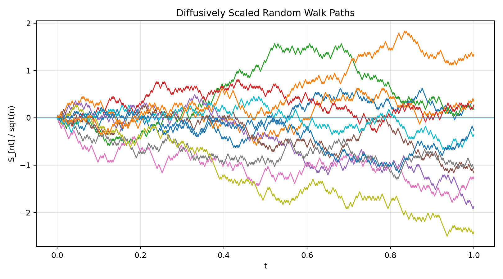
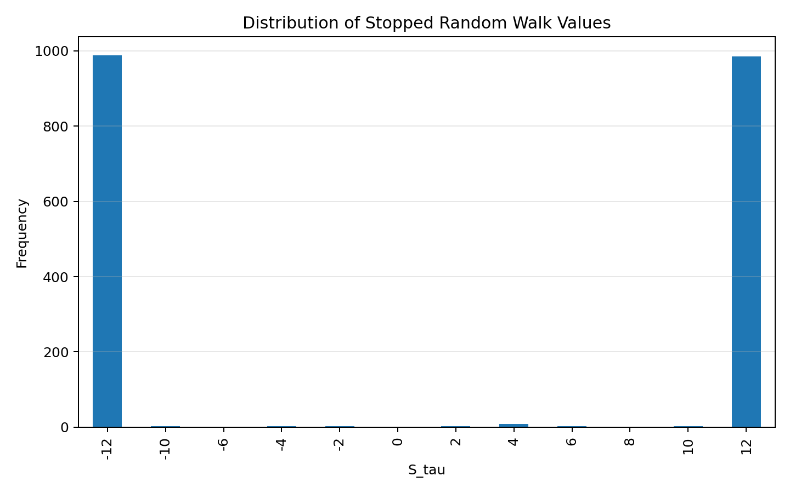
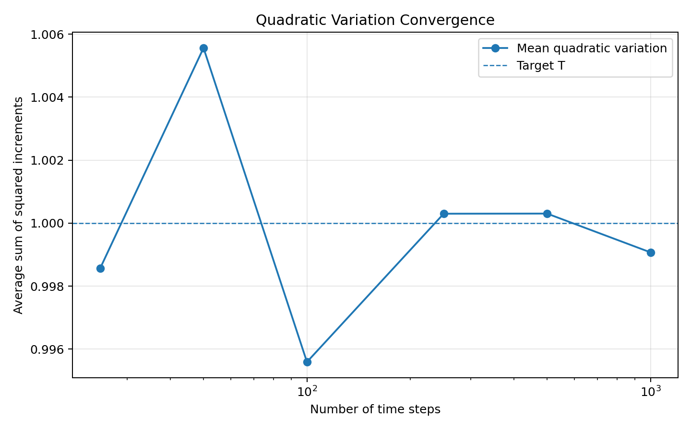
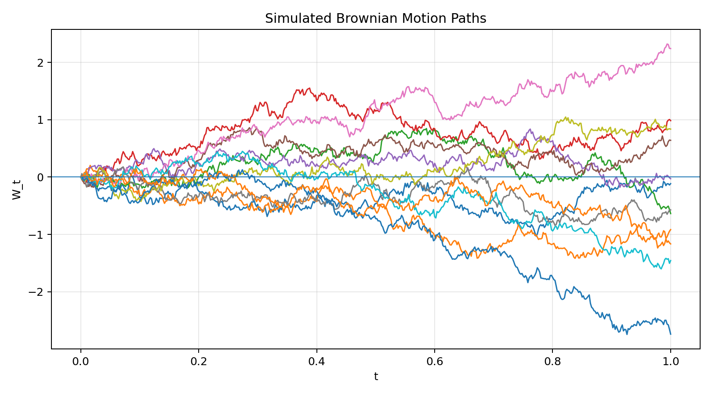
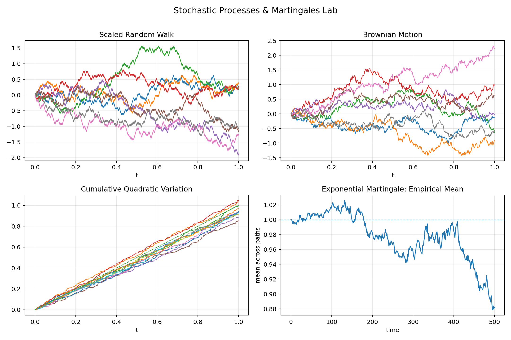

# Stochastic Processes & Martingales Lab

A proof-driven mathematical research project on random walks, filtrations, martingales, stopping times, quadratic variation, and convergence toward Brownian motion.

This repository is the **mathematical foundation layer** behind a quantitative research profile:

> Before alpha diagnostics and portfolio construction, there is probability theory.

The project is intentionally not an investment repository. It does not present a portfolio, a trading strategy, or a backtest. Instead, it builds the mathematical objects that later appear implicitly in systematic research: information evolving through time, conditional expectation, stopping rules, path variation, scaling limits, and stochastic convergence.

---

## Positioning

This repository is designed to complete a three-layer research story:

```text
Stochastic Processes & Martingales Lab  ->  mathematical foundation
Alpha Diagnostics Lab                   ->  signal validation layer
Signal-to-Portfolio                     ->  allocation and risk layer
```

The goal is to show that quantitative research is not treated as only a coding exercise. The repository starts from definitions and proof sketches, then adds simulations only as a way to make the mathematics visible.

---

## Project Scope

The lab focuses on five core themes:

1. **Random walks and filtrations**
   - Discrete-time stochastic processes
   - Natural filtrations
   - Adaptedness and information flow

2. **Martingales**
   - Fair-game property
   - Conditional expectation intuition
   - Exponential martingales for random walks

3. **Stopping times and optional stopping**
   - First hitting times
   - Bounded stopping rules
   - Why stopping a fair game does not automatically create edge

4. **Quadratic variation**
   - Pathwise accumulation of squared increments
   - Why Brownian paths are rough but mathematically structured
   - Convergence of quadratic variation toward elapsed time

5. **Random walk convergence toward Brownian motion**
   - Diffusive scaling
   - Donsker-style intuition
   - From discrete increments to continuous stochastic paths

---

## What Makes This Repo Different

Most finance-facing GitHub projects jump directly to prices, signals, and portfolios. This repo moves one layer deeper.

It asks:

```text
What is the mathematical language underneath time, uncertainty, information, and stochastic evolution?
```

The code is deliberately secondary. The main intellectual output is the collection of mathematical notes and the compact research note in `paper/`.

---

## Example Outputs

### Random Walk Scaling



### Optional Stopping Simulation



### Quadratic Variation Convergence



### Brownian Motion Paths



### Research Dashboard



---

## Repository Structure

```text
stochastic-processes-martingales-lab/
├── README.md
├── requirements.txt
├── pyproject.toml
├── run_analysis.py
├── src/
│   └── stochastic_lab/
│       ├── __init__.py
│       ├── random_walk.py
│       ├── martingales.py
│       ├── stopping_times.py
│       ├── brownian_motion.py
│       ├── diagnostics.py
│       ├── plotting.py
│       └── report.py
├── notes/
│   ├── 01_random_walks_and_filtrations.md
│   ├── 02_martingales.md
│   ├── 03_stopping_times_and_optional_stopping.md
│   ├── 04_quadratic_variation.md
│   ├── 05_random_walks_to_brownian_motion.md
│   └── 06_bridge_to_quantitative_research.md
├── notebooks/
│   ├── random_walk_to_brownian_motion.ipynb
│   └── martingales_and_stopping_times.ipynb
├── paper/
│   ├── stochastic_processes_note.md
│   └── stochastic_processes_note.pdf
├── figures/
├── data/
├── reports/
└── tests/
```

---

## Quick Start

Install dependencies:

```bash
pip install -r requirements.txt
```

Run the full analysis:

```bash
python run_analysis.py
```

This regenerates:

- simulation outputs in `data/`
- figures in `figures/`
- the compact research summary in `reports/`

Run tests:

```bash
pytest
```

---

## Mathematical Research Note

The main note is available here:

[`paper/stochastic_processes_note.md`](paper/stochastic_processes_note.md)

A PDF version is included for easier sharing:

[`paper/stochastic_processes_note.pdf`](paper/stochastic_processes_note.pdf)

The note is written as a compact mathematical essay rather than a notebook. It defines the core objects, states the key propositions, gives proof sketches, and explains why each object matters for systematic research without turning the project into a finance backtest.

---

## Current Research Interpretation

The simulations reproduce the core mathematical intuition:

- symmetric random walks behave as martingales under their natural filtration;
- bounded stopping rules preserve the fair-game expectation in the optional stopping experiment;
- Brownian quadratic variation concentrates around elapsed time;
- scaled random walks visually approach continuous Brownian-like paths.

These are not empirical trading claims. They are controlled demonstrations of mathematical structure.

---

## Limitations

- The project uses synthetic stochastic processes, not market data.
- Proofs are compact and educational, not a full graduate probability textbook treatment.
- Brownian convergence is illustrated numerically rather than proven in full functional-analysis detail.
- Conditional expectations are explained through finite-state and simulation intuition.

---

## Next Steps

Potential extensions:

- Add Doob's maximal inequality with simulation diagnostics
- Add predictable processes and discrete stochastic integration
- Add Ito integral construction from simple processes
- Add Girsanov theorem as a bridge to measure changes
- Add empirical martingale tests on residualized return processes
- Add a treatment-effect note on stochastic interventions and potential outcomes over time

---

## Related Projects

This repo is meant to sit beside:

- **Alpha Diagnostics Lab** - tests whether a signal contains information
- **Signal-to-Portfolio** - translates signal information into risk-aware allocation

Together, the three repositories form a compact research arc:

```text
Mathematical foundation -> Alpha validation -> Portfolio construction
```
